**Total Time: 26.75h**

# June 24th: Let it begin.
Today I began work on my project, designing the PCB for the control board. This board will send power and data to each fixture (up to 4 maximum) to allow me to control them. Im using some open source software call [WLED](https://kno.wled.ge/) for this.

I started the schematic off with the connectors. For inputs I have: power (+24v,10a) and DMX in (GND, DMXIN+, DMXIN-). For outputs I have: 3x Fixture Outputs (+24v with 2a fuse and status LED in series, LED1+, LED1- and GND), 1x Fixture Output (+24v with 1a fuse and status LED in series, LED1+, LED1- and GND).

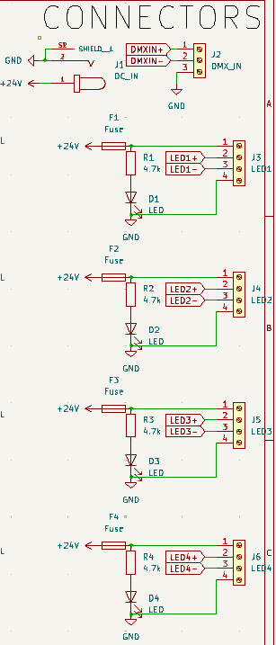

Next, I added the RS-485 modules. Each module takes +5v, GND and data as an input and outputs LED(x)+ and LED(x)-. Both of these data lines are connected to a NUP1250L for ESD protection.

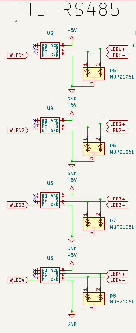

Next, I added some miscelaneous circuits. One of these will step down the 24v power to 5v using a buck converter and the other will decode the DMXIN- and DMXIN+ into DMX_RX, DMX-TX and DMX_EN. The data lines, DMXIN+ and DMXIN- have NUP2105L for ESD resistance.

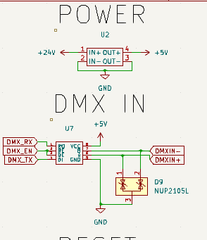

Finally, I added the ESP32. The ESP32 is connected to GND and +5V for power and the 4 LED data lines, WLED1, WLED2, WLED3 and WLED4. The ESP32 also takes the decoded dmx input with DMX_EN, DMX_RX and DMX_TX. The CHIP_PU pin on the ESP32 is also connected to a jumper to allow easy resetting of the ESP32 if it happens to lock up.

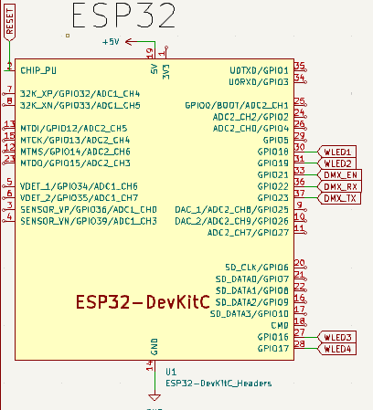

**TIME TAKEN: 5h** Did I mention this is my *first time* desiging a PCB?

# June 25th: Actually getting into the PCB.
Happy 6 months to Christmas! Or if you dont celebrate, happy 6 months to December 25th!

Honestly Im not 100% sure what to write here as I kind of just worked through this and then remembered I need to do the journal.

Anyway, this was an absolute pain as I had to make footprints for my RS-485 and buck converters and I dont own calipers so who knows if they are correct! Once I got this done it went pretty painlessly and most of my troubles were just from learning KiCad.

Ive got a DC barrel jack for the power input and I'm using screw terminals for the DMX-IN and Fixture out. These will then connect to a 3-Pin XLR connect in the case of the DMX-IN and 4 GX12-4 connectors for the fixture outputs. However, I am not going to make a case for this until Im sure my PCB works. My 3D printer is currently broken and I dont have the time, nor money to fix it.

A couple more hours of running tracks, adding cool graphics and fixing errors raised by the DRC and I *think* it's done!

Also, a huge thanks to @pinamouse of the WLED discord server for being a huge inspiration for the controller :D

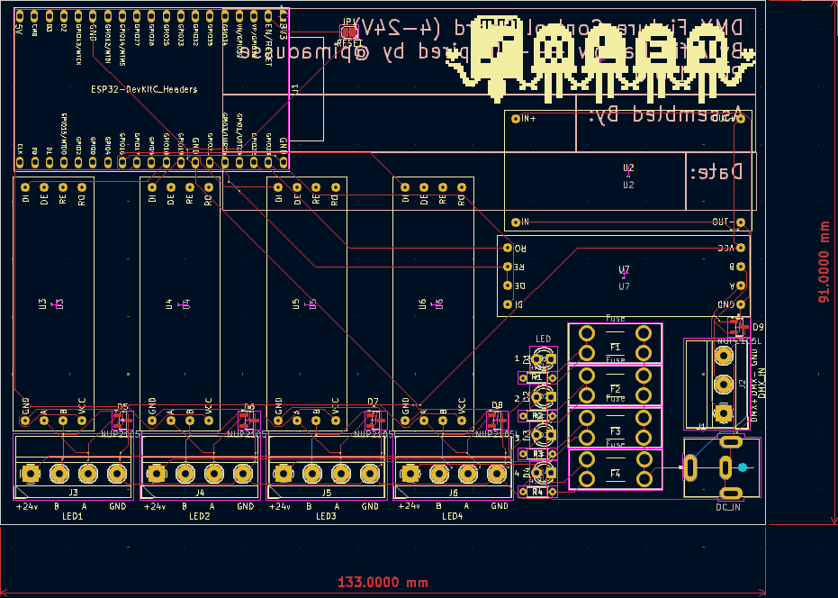

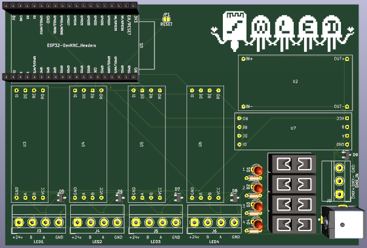

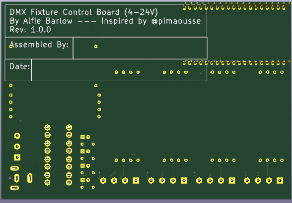

**TIME TAKEN: 7h (estimate, sorry)**

# June 26th: Sorting out a BOM.
Today I spent an hour or two scrolling through Digikey to assemble a BOM for *most* of the resources required to assemble the PCB. The BOM does not include any of the buck converters, RS-485 modules or an ESP32 as these are not on Digikey. I will most likely obtain these through Aliexpress for a rough cost of no more than £10-20/unit. I will add these to the BOM at a later date. I have exported the BOM from digikey and you can find it in the `BOM.csv` file.

It was also at this point of the project where I had to redo at least a good half of the PCB Layout as I needed to change my fuse holder to one that wasnt unobtainium

My next steps now are adding mounting holes to the PCB and testing the circuit.

**Time Taken: 2h (also estimate, sorry)**

# June 27th: Getting the Fixture Board going!
In the future, I plan to make fixture boards supporting many different voltages, but for now I will focus on 24V fixtures with the `24V Fixture Board`.

__Schematic__
To start I need another 4-pin screw terminal that will be connected to a GX12-4 connector. Also, cant forget ESD protection on this side too! Also, a 3-pin JST connector is required for the fixture itself, outputting 24v, data and GND.

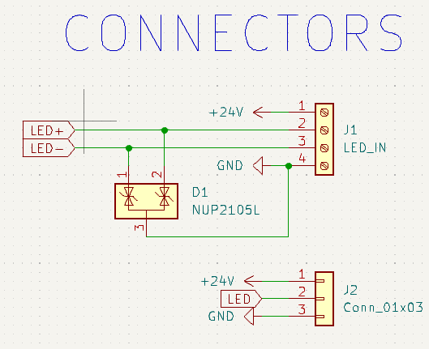

Next, I need to handle power conversion. Same as last time really, just stick a buck converter in tuned to 5v and thats that done. However, a slight change is I need to add a capacitor to handle the voltage drop over the long cable to the fixture.

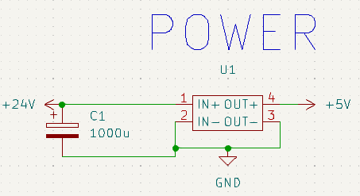

Finally, just need the RS485 module to convert LED+ and LED- to a singular data line. Jusat a 5v input, LED+ to B, LED- to A, GND, connect LED to RO and connewct RE and DE to GND and thats all thats needed!

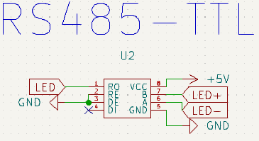

__PCB__
Next step on the list, laying this all out on a board.

This started off with the usual hell of "Oh no I need to find footprints" and then guessing some, and probably soon changing them as any parts that would fit in that footprint are long obselete.

Once I got all the footprints together this was actually quite a simple layout. 4 pin header on one side, JST connector for the strip on the otherside and just throw all the parts in between and call it a day. However, this was my first time utilising both sides of the PCB so that proved to be interesting.

Add some graphics and text and boom, it done.

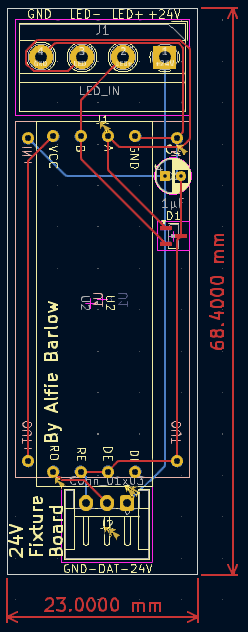

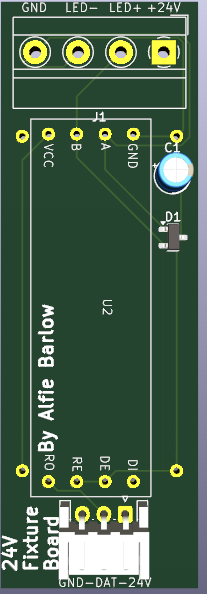

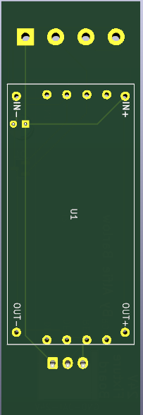

**Time Taken: 5h**

# June 28th: The BOM... (scary..!)
Once again, doing this fun stuff in 2 parts: the Digikey BOM and the "Other" BOM. Started off with the Digikey BOM and that was relitively easy as it used almost all of the same parts. The only item I needed to find was a 3-Pin horizontal JST connector which was easy enough.

Next up, the "Other" BOM for the 24V Fixture board. This is quite simple as all that is needed is a buck converter and a RS-485 module. this will include details for a case but as mentioned above, that is being left until I am sure everything works as my 3D printer is broken (parts are on route! but ebay shipping is pain). I alsoe needed to calculate a cost of the PCB which currently could change. This had been added to the BOM.

The "Other" BOM for the Control Board has also been created featuring basically the same parts + its own PCB which I do not expect the price of to change by much.

**Time Taken: 3h**

# June 14th: The BOM... (scary..!...again)
After a short break while I was away, I'm back at it again!

This time I have created the BOM for the fixture itself, consisting of a control board, the LED strip and the polycarbonate tube used to diffuse the LED. For the control board in this BOM I have just totalled the BOM of the `24V Fixture Board` and added this as an item to the BOM. 

**Time Taken: 45m**

# June 17th: More BOM work!
It was a sad, rainy day... Well it wasnt really I just hate BOMs. Anyway I started off by removing some useless columns from the Digikey BOM and reformating the other BOMs to use that format for easier combination. 

I then combined the digikey + other BOMs into 1 BOM.

Following this, I have combined the individual BOMs into one single BOM with 4x 24V LED Bar Fixtures and 1x Control Board.

Next, I made the README.md, added some pictures and put the BOM at the bottom like required.

Oh, I also went through and added links to the main BOM.

*my brain is a mess*

**Time Taken: 2.5h**

# June 24th: Fixing the submission.
I was informed by Highway that I need to use LCSC. So, I have spent some time finding the components I needed on LCSC and changing components where nessecary.

While I was doing this, I have basically redone all the trace layout because I kind of had to anyway.

I attempted to contact WeProFab for a quote for the Polycarbonate tube but was met with no response so I will have to stick with my eBay supplier for now.

**Time Taken: 1.5h**

# --- APPROVED FOR HIGHWAY | BELOW THIS LINE IS NOT INCLUDED IN TOTAL TIME ---

# June 27th: Safety is key.
Safety is key, and this is why i decided default track width was NOT a good decision for 8 amps, so I changed this.

I have also changed to a 10A capable barrel jack and replaced the randon 1A fuse with a 2A one.

**Time Taken: 1h**
