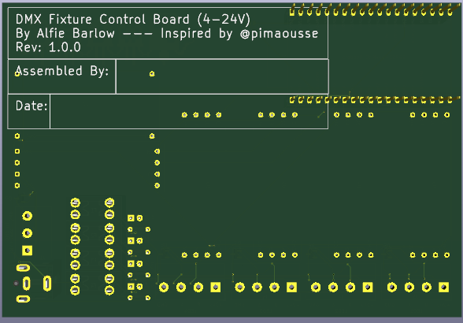
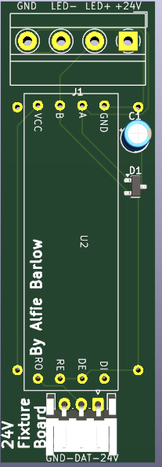

# Alfie's Custom DMX Fixtures
## What is this?
This project contains any relevant files for Custom DMX Fixtures project. In this repository you can find a PCB controller board, compatible with Neopixel LEDs using WLED. A fixture board which converts the signal sent from the controller to something usable by the Neopixel strip. And a LED Bar Fixture using the 24V version of the fixture control board.

## Why did you make this?
I volunteer at my school running our lighting rig for our shows. After one show in February, I realised something was missing and that it would look awesome with some kind of bar fixture. So I started this project and here we are now :D

# Images
Here are some relevant pictures of my project. Ill add more as I have then and as is needed.

## Control Board

## 24V Fixture Board

# Firmware
For the firmware, you can use any compilation of WLED with DMX enabled.

You can compile WLED at [this website](https://wled-compile.github.io/?lang=en) using my config file in the root of this repository called `firmware.json`

# External Wiring
A DMX Fixture is basically a fancy name for a software controlled light, usually in a theatrical setting. My Fixtures are connected to the controlled using a GX12-4 cable matching 24V with 24V, A with A, B with B and GND with GND. Relatively simple!

# How to use.
Once you have the firmware installed there is 2 ways you can use this.

## No DMX
This can be purely controlled by any WLED control software. For mobile, I use WLED Native or just go to the IP of the controller on desktop. You can then change the colour and set effects through here

## DMX
This is a bit more complicated. Once you have connected the controller to your computer via a DMX interface you can open any DMX control software like QLC+ and import the configuration of the lights (Coming soon! I cant create a configuration without having at least a prototype) and then you can control the lights through QLC+. Remember to make sure you have no overlapping channels though!

# BOM
The following table and `BOM.csv` file are a combination of 4x 24V LED Bar Fixtures and 1x Control Board. For the individual BOMs see `BOM.md`

**Total BOM Cost: $223.09**

|Mrf#                  |Mfr.                        |Order Qty.|Unit Price(USD)|Ext.Price(USD)|LCSC#    |Package                         |Min|Mult|SPQ |Availability|Stock Status|Customer Notes|Description                                                                                                                 |Product Link                                                                                                                                                                                                                                                                                                                                                                                                                                                                                                                                                  |
|----------------------|----------------------------|----------|---------------|--------------|---------|--------------------------------|---|----|----|------------|------------|--------------|----------------------------------------------------------------------------------------------------------------------------|--------------------------------------------------------------------------------------------------------------------------------------------------------------------------------------------------------------------------------------------------------------------------------------------------------------------------------------------------------------------------------------------------------------------------------------------------------------------------------------------------------------------------------------------------------------|
|TZ-L2-03YYBG2TDJ30-002|TUOZHAN                     |20        |0.0213         |0.43          |C779432  |Through Hole,D=3mm              |20 |20  |1000|300         |In Stock    |              |Emerald Green 3mm Round Lens Through Hole,D=3mm LED Indication - Discrete ROHS                                              |https://lcsc.com/product-detail/led-indication-discrete_tuozhan-tz-l2-03yybg2tdj30-002_C779432.html                                                                                                                                                                                                                                                                                                                                                                                                                                                           |
|NUP2105L              |(DIOTEC)                    |10        |0.0899         |0.9           |C3700834 |SOT-23-3                        |5  |5   |3000|45          |In Stock    |              |8A@8/20us 350W 44V 26.2V 24V SOT-23-3 ESD and Surge Protection (TVS/ESD) ROHS                                               |https://lcsc.com/product-detail/esd-and-surge-protection-tvs-esd_diotec-nup2105l_C3700834.html                                                                                                                                                                                                                                                                                                                                                                                                                                                                |
|178.6165.0002         |Littelfuse                  |4         |2.1355         |8.54          |C207061  |Through Hole                    |1  |1   |500 |2007        |In Stock    |              |Through Hole Fuseholders ROHS                                                                                               |https://lcsc.com/product-detail/fuseholders_littelfuse-178-6165-0002_C207061.html                                                                                                                                                                                                                                                                                                                                                                                                                                                                             |
|DB302-5.0-3P-GN-S     |DORABO                      |5         |0.2851         |1.43          |C2997276 |P=5mm                           |5  |5   |500 |1085        |In Stock    |              |1x3P -40℃~+105℃ 30A 300V Green Through Hole 5mm 1 3 P=5mm Screw Terminal Blocks ROHS                                        |https://lcsc.com/product-detail/screw-terminal-blocks_dorabo-db302-5-0-3p-gn-s_C2997276.html                                                                                                                                                                                                                                                                                                                                                                                                                                                                  |
|2.54-1*4P             |BOOMELE(Boom Precision Elec)|20        |0.0469         |0.94          |C2718488 |Through Hole,P=2.54mm           |10 |10  |1000|38270       |In Stock    |              |2.54mm 1 3A 4P Bronze -40℃~+105℃ Through Hole 1x4P Top Square Hole Through Hole,P=2.54mm Female Headers ROHS                |https://lcsc.com/product-detail/female-headers_boomele-boom-precision-elec-2-54-1-4p_C2718488.html                                                                                                                                                                                                                                                                                                                                                                                                                                                            |
|PM254-1-19-Z-8.5      |HCTL                        |5         |0.3055         |1.53          |C2897382 |Through Hole,P=2.54mm           |5  |5   |120 |6380        |In Stock    |              |2.54mm 1 3A Copper Alloy 19P -40℃~+105℃ Through Hole 1x19P 8.5mm Top Square Hole Through Hole,P=2.54mm Female Headers ROHS  |https://lcsc.com/product-detail/female-headers_hctl-pm254-1-19-z-8-5_C2897382.html                                                                                                                                                                                                                                                                                                                                                                                                                                                                            |
|ZX-PZ2.54-1-1PZZ      |Megastar                    |20        |0.0116         |0.23          |C7501259 |Through Hole,P=2.54mm           |20 |20  |2000|33300       |In Stock    |              |Gold 3A Through Hole Pin Header 2.5mm 1P 6mm -40℃~+105℃ 3mm 2.54mm Brass Black 1 1x1P Through Hole,P=2.54mm Pin Headers ROHS|https://lcsc.com/product-detail/pin-headers_megastar-zx-pz2-54-1-1pzz_C7501259.html                                                                                                                                                                                                                                                                                                                                                                                                                                                                           |
|DB302-5.0-4P-GN-S     |DORABO                      |8         |0.4435         |3.55          |C5143708 |Through Hole,P=5mm              |1  |1   |200 |647         |In Stock    |              |20A 1x4P -40℃~+105℃ 300V Green Through Hole 5mm 1 4 Through Hole,P=5mm Screw Terminal Blocks ROHS                           |https://lcsc.com/product-detail/screw-terminal-blocks_dorabo-db302-5-0-4p-gn-s_C5143708.html                                                                                                                                                                                                                                                                                                                                                                                                                                                                  |
|MFR-25FTE52-4K7       |YAGEO                       |50        |0.0117         |0.59          |C173023  |Through Hole,D2.4xL6.3mm        |50 |50  |5000|62150       |In Stock    |              |Metal Film Resistor 4.7kΩ 250mW ±50ppm/℃ ±1% Through Hole,D2.4xL6.3mm Through Hole Resistors ROHS                           |https://lcsc.com/product-detail/through-hole-resistors_yageo-mfr-25fte52-4k7_C173023.html                                                                                                                                                                                                                                                                                                                                                                                                                                                                     |
|0287002.PXCN          |Littelfuse                  |5         |0.1083         |0.54          |C142680  |-                               |5  |5   |2000|2320        |In Stock    |              |32V 1kA Blade Fuse 2A Automotive Fuses ROHS                                                                                 |https://lcsc.com/product-detail/automotive-fuses_littelfuse-0287002-pxcn_C142680.html                                                                                                                                                                                                                                                                                                                                                                                                                                                                         |
|DC-508-ARL250-H069    |XUNPU                       |1         |1.3904         |1.39          |C34388679|Through Hole                    |1  |1   |400 |357         |In Stock    |              |Right Angle DC Power Jack -40℃~+85℃ 2.5mm 5.7mm 20A 30V Through Hole DC Power Connectors ROHS                               |https://lcsc.com/product-detail/dc-power-connectors_xunpu-dc-508-arl250-h069_C34388679.html                                                                                                                                                                                                                                                                                                                                                                                                                                                                   |
|S3B-EH(LF)(SN)        |JST                         |10        |0.0458         |0.46          |C263754  |Through Hole,Right Angle,P=2.5mm|10 |10  |1000|60          |In Stock    |              |1x3P 3P EH Tin 3 -25℃~+85℃ 3A 1 2.5mm Brass Right Angle Through Hole,Right Angle,P=2.5mm Wire To Board Connector ROHS       |https://lcsc.com/product-detail/wire-to-board-connector_jst-s3b-eh-lf-sn_C263754.html                                                                                                                                                                                                                                                                                                                                                                                                                                                                         |
|-                     |-                           |5         |0.98           |4.9           |-        |-                               |-  |-   |-   |-           |-           |              |LM2596                                                                                                                      |https://www.aliexpress.com/item/1005004904872120.html?spm=a2g0o.productlist.main.1.648c541bqH9rJl&algo_pvid=3365030b-ba65-48ef-b795-25a7323940d2&algo_exp_id=3365030b-ba65-48ef-b795-25a7323940d2-0&pdp_ext_f=%7B%22order%22%3A%224923%22%2C%22eval%22%3A%221%22%7D&pdp_npi=4%40dis%21GBP%210.98%210.98%21%21%211.31%211.31%21%40210385a817511532162265793e9d93%2112000030968453860%21sea%21UK%216246721987%21X&curPageLogUid=SCB0lC5DUt0Q&utparam-url=scene%3Asearch%7Cquery_from%3A                                                                         |
|-                     |-                           |9         |0.28           |2.52          |-        |-                               |-  |-   |-   |-           |-           |              |RS-485 TTL                                                                                                                  |https://www.aliexpress.com/item/1005005737922222.html?spm=a2g0o.cart.0.0.29fc38dazYWvCI&mp=1&pdp_npi=5%40dis%21GBP%21GBP%202.28%21GBP%201.49%21%21GBP%201.49%21%21%21%402103846917511531537767901edbce%211200004452696347                                                                                                                                                                                                                                                                                                                                     |
|-                     |-                           |1         |3.42           |3.42          |-        |-                               |-  |-   |-   |-           |-           |              |ESP32-DevKitC                                                                                                               |https://www.aliexpress.com/item/1005007820190456.html?spm=a2g0o.productlist.main.1.3c437abdXeRiKL&algo_pvid=a9f971fb-d5f2-470f-8ec5-9bb780a11c0e&algo_exp_id=a9f971fb-d5f2-470f-8ec5-9bb780a11c0e-0&pdp_ext_f=%7B%22order%22%3A%22911%22%2C%22eval%22%3A%221%22%7D&pdp_npi=4%40dis%21GBP%212.21%211.49%21%21%2121.10%2114.22%21%4021038da617511538383186262ec7d4%2112000042325137321%21sea%21UK%216246721987%21X&curPageLogUid=NeRNsyLEpTQ8&utparam-url=scene%3Asearch%7Cquery_from%3A                                                                        |
|-                     |-                           |1         |13.4           |13.4          |-        |-                               |-  |-   |-   |-           |-           |              |Control Board PCB                                                                                                           |                                                                                                                                                                                                                                                                                                                                                                                                                                                                                                                                                              |
|-                     |-                           |4         |6              |24            |-        |-                               |-  |-   |-   |-           |-           |              |24V Fixture PCB                                                                                                             |                                                                                                                                                                                                                                                                                                                                                                                                                                                                                                                                                              |
|-                     |-                           |4         |20.21          |80.84         |-        |-                               |-  |-   |-   |-           |-           |              |Polycarbonate Tube                                                                                                          |https://www.ebay.co.uk/itm/276693351932?_skw=frosted+round+rigid+polycarbonate+tube&itmmeta=01K04KKFDF3AJ286QVF0MJMHY5&hash=item406c357dfc%3Ag%3AltAAAOSwSiBnE-rc&itmprp=enc%3AAQAKAAAA4FkggFvd1GGDu0w3yXCmi1f7aXwdpIx9IYPY3Br8vi7vcu88WAFKXgSIObTo99wU94qLx%2F4q%2B8mSy8yiOFfK2O9yquNEseovPOWru4rv4ONDsM%2FCkBpKu4MNbLXtH8TfDre93db7qzknJPlWCpg3coSkv4xKbH2xQ5bO3E0Tuu97E%2F3SG4%2FbP1yk3JdD4ooG5DHvHmOt1lcXt3%2F71JB3%2FbCF74wIcgGMwe5mazzk4QTK2%2B6wlIg3E3qEpVTSkJJrFB8WyLjw0a2LjLRXMIImqgTV%2BJngFIAjqnugciSfxVUS%7Ctkp%3ABk9SR-72zZOBZg&var=2560126467598|
|-                     |-                           |4         |14.57          |58.28         |-        |-                               |-  |-   |-   |-           |-           |              |WS2811-COB                                                                                                                  |https://www.aliexpress.com/item/1005008502347105.html?algo_exp_id=5c1c1235-e70a-4246-a32f-a700219098fe-4&pdp_ext_f=%7B%22order%22%3A%2231%22%2C%22eval%22%3A%221%22%7D&pdp_npi=4%40dis!GBP!10.65!5.05!!!14.16!6.72!%4021038df617509815831908318e4312!12000045561188117!sea!UK!0!ABX&curPageLogUid=G9q3zAPoAXfc&utparam-url=scene%3Asearch%7Cquery_from%3A                                                                                                                                                                                                     |
|-                     |-                           |1         |10.99          |10.99         |-        |-                               |-  |-   |-   |-           |-           |              |24V 10A PSU                                                                                                                 |https://www.aliexpress.com/item/1005005763465796.html?spm=a2g0o.cart.0.0.155638darvq6KW&mp=1&pdp_npi=5%40dis%21GBP%21GBP%208.33%21GBP%208.33%21%21GBP%208.33%21%21%21%402103963717533502035943943e99db%2112000034265307623%21ct%21UK%216246721987%21%211%210                                                                                                                                                                                                                                                                                                  |
|-                     |-                           |1         |3.04           |3.04          |-        |-                               |-  |-   |-   |-           |-           |              |DMX Input                                                                                                                   |https://www.aliexpress.com/item/1005007432049215.html?spm=a2g0o.productlist.main.5.16547d36LxjoCa&algo_pvid=45811b24-a078-4e17-af7d-c0fac50111f5&algo_exp_id=45811b24-a078-4e17-af7d-c0fac50111f5-4&pdp_ext_f=%7B%22order%22%3A%22289%22%2C%22eval%22%3A%221%22%7D&pdp_npi=4%40dis%21USD%213.04%213.04%21%21%213.04%213.04%21%40211b815c17533503935243532e9857%2112000040758600589%21sea%21UK%216246721987%21X&curPageLogUid=vV8bw7n6iAWJ&utparam-url=scene%3Asearch%7Cquery_from%3A                                                                          |
|-                     |-                           |8         |0.32           |2.56          |-        |-                               |-  |-   |-   |-           |-           |              |Fixture Connectors                                                                                                          |https://www.aliexpress.com/item/1005002920441877.html?spm=a2g0o.productlist.main.17.43a51e24Vo5Vvb&algo_pvid=c1b3e4c4-fd95-47fd-973d-1b4b3ff86cb8&algo_exp_id=c1b3e4c4-fd95-47fd-973d-1b4b3ff86cb8-16&pdp_ext_f=%7B%22order%22%3A%2212%22%2C%22eval%22%3A%221%22%7D&pdp_npi=4%40dis%21USD%210.16%210.12%21%21%210.16%210.12%21%40210384cc17533504720682578efd31%2112000022803273504%21sea%21UK%216246721987%21X&curPageLogUid=EQ0dn1qLd6nB&utparam-url=scene%3Asearch%7Cquery_from%3A                                                                         |
