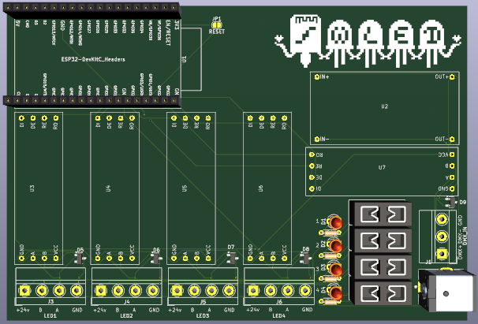
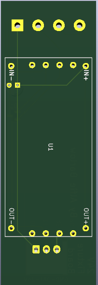

# Alfie's Custom DMX Fixtures
## What is this?
This project contains any relevant files for Custom DMX Fixtures project. In this repository you can find a PCB controller board, compatible with Neopixel LEDs using WLED. A fixture board which converts the signal sent from the controller to something usable by the Neopixel strip. And a LED Bar Fixture using the 24V version of the fixture control board.

## Why did you make this?
I volunteer at my school running our lighting rig for our shows. After one show in February, I realised something was missing and that it would look awesome with some kind of bar fixture. So I started this project and here we are now :D

# Images
Here are some relevant pictures of my project. Ill add more as I have then and as is needed.

## Control Board

## 24V Fixture Board

# Firmware
For the firmware, you can use any compilation of WLED with DMX enabled.

You can compile WLED at [this website](https://wled-compile.github.io/?lang=en) using my config file in the root of this repository called `firmware.json`

# BOM
The following table and `BOM.csv` file are a combination of 4x 24V LED Bar Fixtures and 1x Control Board. For the individual BOMs see `BOM.md`

**Total BOM Cost: $238.09**

|Index|Manufacturer Part Number|Manufacturer Name              |Description                     |Requested Quantity 1|Pack Quantity 1|Digi-Key Part Number 1|Unit Price 1 |Extended Price 1|Product Notes                                                                                                                                                                                                                                                                                                                                                                                                                                                                         |FIELD11                                                                                                                                                                                                                                                                                                                                                                                                                                                                                                                                                       |
|-----|------------------------|-------------------------------|--------------------------------|--------------------|---------------|----------------------|-------------|----------------|--------------------------------------------------------------------------------------------------------------------------------------------------------------------------------------------------------------------------------------------------------------------------------------------------------------------------------------------------------------------------------------------------------------------------------------------------------------------------------------|--------------------------------------------------------------------------------------------------------------------------------------------------------------------------------------------------------------------------------------------------------------------------------------------------------------------------------------------------------------------------------------------------------------------------------------------------------------------------------------------------------------------------------------------------------------|
|1    |151031VS06000           |Würth Elektronik               |LED GREEN DIFFUSED 3MM ROUND T/H|4                   |4              |732-5008-ND           |0.15         |$0.60           |                                                                                                                                                                                                                                                                                                                                                                                                                                                                                      |                                                                                                                                                                                                                                                                                                                                                                                                                                                                                                                                                              |
|2    |NUP2105L                |Diotec Semiconductor           |TVS DIODE 24VWM 44VC SOT233     |9                   |9              |4878-NUP2105LCT-ND    |0.23         |$2.07           |                                                                                                                                                                                                                                                                                                                                                                                                                                                                                      |                                                                                                                                                                                                                                                                                                                                                                                                                                                                                                                                                              |
|3    |3568                    |Keystone Electronics           |FUSE HOLDER BLADE 500V 30A PCB  |4                   |4              |36-3568-ND            |1.2          |$4.80           |                                                                                                                                                                                                                                                                                                                                                                                                                                                                                      |                                                                                                                                                                                                                                                                                                                                                                                                                                                                                                                                                              |
|4    |31271103                |METZ CONNECT USA Inc.          |SCREW TYPE, TERMINAL BLOCK, RIGH|1                   |1              |1849-1335-ND          |1.56         |$1.56           |                                                                                                                                                                                                                                                                                                                                                                                                                                                                                      |                                                                                                                                                                                                                                                                                                                                                                                                                                                                                                                                                              |
|5    |PPTC041LFBN-RC          |Sullins Connector Solutions    |CONN HDR 4POS 0.1 TIN PCB       |18                  |18             |S7002-ND              |0.313        |$5.63           |                                                                                                                                                                                                                                                                                                                                                                                                                                                                                      |                                                                                                                                                                                                                                                                                                                                                                                                                                                                                                                                                              |
|6    |PPTC191LFBN-RC          |Sullins Connector Solutions    |CONN HDR 19POS 0.1 TIN PCB      |2                   |2              |S7017-ND              |1.05         |$2.10           |                                                                                                                                                                                                                                                                                                                                                                                                                                                                                      |                                                                                                                                                                                                                                                                                                                                                                                                                                                                                                                                                              |
|7    |87224-1                 |TE Connectivity AMP Connectors |CONN HEADER VERT 1POS           |20                  |20             |A26541-ND             |0.65         |$13.4           |                                                                                                                                                                                                                                                                                                                                                                                                                                                                                      |                                                                                                                                                                                                                                                                                                                                                                                                                                                                                                                                                              |
|8    |31059104                |METZ CONNECT USA Inc.          |SCREW TYPE, TERMINAL BLOCK, RIGH|8                   |8              |1849-1341-ND          |2.12         |$16.96          |                                                                                                                                                                                                                                                                                                                                                                                                                                                                                      |                                                                                                                                                                                                                                                                                                                                                                                                                                                                                                                                                              |
|9    |CF12JT4K70              |Stackpole Electronics Inc      |RES 4.7K OHM 5% 1/2W AXIAL      |4                   |4              |CF12JT4K70CT-ND       |0.1          |$0.40           |                                                                                                                                                                                                                                                                                                                                                                                                                                                                                      |                                                                                                                                                                                                                                                                                                                                                                                                                                                                                                                                                              |
|10   |0287002.PXCN            |Littelfuse Inc.                |FUSE AUTO 2A 32VDC BLADE ATO/ATC|3                   |3              |F4192-ND              |0.39         |$1.17           |                                                                                                                                                                                                                                                                                                                                                                                                                                                                                      |                                                                                                                                                                                                                                                                                                                                                                                                                                                                                                                                                              |
|11   |PJ-063AH                |Same Sky (Formerly CUI Devices)|CONN PWR JACK 2X5.5MM SOLDER    |1                   |1              |CP-063AH-ND           |1.5          |$1.50           |                                                                                                                                                                                                                                                                                                                                                                                                                                                                                      |                                                                                                                                                                                                                                                                                                                                                                                                                                                                                                                                                              |
|12   |0287001.U               |Littelfuse Inc.                |FUSE AUTO 1A 32VDC BLADE ATO/ATC|1                   |1              |0287001.U-ND          |0.43         |$0.43           |                                                                                                                                                                                                                                                                                                                                                                                                                                                                                      |                                                                                                                                                                                                                                                                                                                                                                                                                                                                                                                                                              |
|13   |LM2596                  |N/A                            |N/A                             |5                   |N/A            |N/A                   |0.98         |$4.90           |https://www.aliexpress.com/item/1005004904872120.html?spm=a2g0o.productlist.main.1.648c541bqH9rJl&algo_pvid=3365030b-ba65-48ef-b795-25a7323940d2&algo_exp_id=3365030b-ba65-48ef-b795-25a7323940d2-0&pdp_ext_f=%7B%22order%22%3A%224923%22%2C%22eval%22%3A%221%22%7D&pdp_npi=4%40dis%21GBP%210.98%210.98%21%21%211.31%211.31%21%40210385a817511532162265793e9d93%2112000030968453860%21sea%21UK%216246721987%21X&curPageLogUid=SCB0lC5DUt0Q&utparam-url=scene%3Asearch%7Cquery_from%3A |                                                                                                                                                                                                                                                                                                                                                                                                                                                                                                                                                              |
|14   |RS-485 TTL              |N/A                            |N/A                             |9                   |N/A            |N/A                   |0.28         |$2.52           |https://www.aliexpress.com/item/1005005737922222.html?spm=a2g0o.cart.0.0.29fc38dazYWvCI&mp=1&pdp_npi=5%40dis%21GBP%21GBP%202.28%21GBP%201.49%21%21GBP%201.49%21%21%21%402103846917511531537767901edbce%211200004452696347                                                                                                                                                                                                                                                             |                                                                                                                                                                                                                                                                                                                                                                                                                                                                                                                                                              |
|15   |ESP32-DevKitC           |N/A                            |N/A                             |1                   |N/A            |N/A                   |3.42         |$3.42           |https://www.aliexpress.com/item/1005007820190456.html?spm=a2g0o.productlist.main.1.3c437abdXeRiKL&algo_pvid=a9f971fb-d5f2-470f-8ec5-9bb780a11c0e&algo_exp_id=a9f971fb-d5f2-470f-8ec5-9bb780a11c0e-0&pdp_ext_f=%7B%22order%22%3A%22911%22%2C%22eval%22%3A%221%22%7D&pdp_npi=4%40dis%21GBP%212.21%211.49%21%21%2121.10%2114.22%21%4021038da617511538383186262ec7d4%2112000042325137321%21sea%21UK%216246721987%21X&curPageLogUid=NeRNsyLEpTQ8&utparam-url=scene%3Asearch%7Cquery_from%3A|                                                                                                                                                                                                                                                                                                                                                                                                                                                                                                                                                              |
|16   |Control Board PCB       |N/A                            |N/A                             |1                   |N/A            |N/A                   |13.4         |$13.4           |                                                                                                                                                                                                                                                                                                                                                                                                                                                                                      |                                                                                                                                                                                                                                                                                                                                                                                                                                                                                                                                                              |
|17   |S3B-EH                  |JST Sales America Inc.         |CONN HEADER R/A 3POS 2.5MM      |1                   |1              |Bulk                  |455-S3B-EH-ND|0.11            |$0.11                                                                                                                                                                                                                                                                                                                                                                                                                                                                                 |                                                                                                                                                                                                                                                                                                                                                                                                                                                                                                                                                              |
|18   |24V Fixture PCB         |N/A                            |                                |4                   |N/A            |N/A                   |N/A          |6               |$24                                                                                                                                                                                                                                                                                                                                                                                                                                                                                   |                                                                                                                                                                                                                                                                                                                                                                                                                                                                                                                                                              |
|19   |N/A                     |N/A                            |24V Fixture Board               |4                   |N/A            |N/A                   |N/A          |12.26           |$49.04                                                                                                                                                                                                                                                                                                                                                                                                                                                                                |                                                                                                                                                                                                                                                                                                                                                                                                                                                                                                                                                              |
|20   |N/A                     |N/A                            |N/A                             |4                   |N/A            |N/A                   |N/A          |20.21           |$80.84                                                                                                                                                                                                                                                                                                                                                                                                                                                                                |https://www.ebay.co.uk/itm/276693351932?_skw=frosted+round+rigid+polycarbonate+tube&itmmeta=01K04KKFDF3AJ286QVF0MJMHY5&hash=item406c357dfc%3Ag%3AltAAAOSwSiBnE-rc&itmprp=enc%3AAQAKAAAA4FkggFvd1GGDu0w3yXCmi1f7aXwdpIx9IYPY3Br8vi7vcu88WAFKXgSIObTo99wU94qLx%2F4q%2B8mSy8yiOFfK2O9yquNEseovPOWru4rv4ONDsM%2FCkBpKu4MNbLXtH8TfDre93db7qzknJPlWCpg3coSkv4xKbH2xQ5bO3E0Tuu97E%2F3SG4%2FbP1yk3JdD4ooG5DHvHmOt1lcXt3%2F71JB3%2FbCF74wIcgGMwe5mazzk4QTK2%2B6wlIg3E3qEpVTSkJJrFB8WyLjw0a2LjLRXMIImqgTV%2BJngFIAjqnugciSfxVUS%7Ctkp%3ABk9SR-72zZOBZg&var=2560126467598|
|21   |WS2811-FCOB             |N/A                            |N/A                             |4                   |N/A            |N/A                   |N/A          |14.57           |$58.28                                                                                                                                                                                                                                                                                                                                                                                                                                                                                |https://www.aliexpress.com/item/1005008502347105.html?algo_exp_id=5c1c1235-e70a-4246-a32f-a700219098fe-4&pdp_ext_f=%7B%22order%22%3A%2231%22%2C%22eval%22%3A%221%22%7D&pdp_npi=4%40dis!GBP!10.65!5.05!!!14.16!6.72!%4021038df617509815831908318e4312!12000045561188117!sea!UK!0!ABX&curPageLogUid=G9q3zAPoAXfc&utparam-url=scene%3Asearch%7Cquery_from%3A                                                                                                                                                                                                     |

